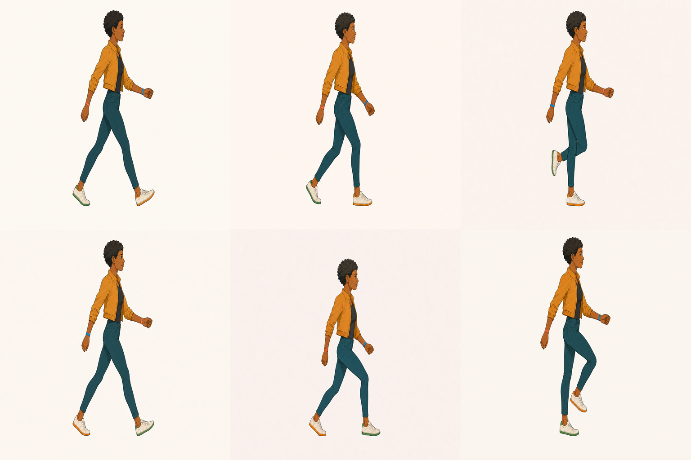
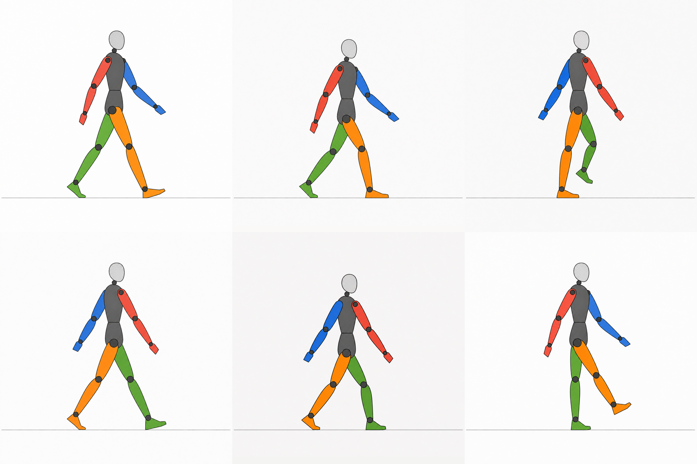
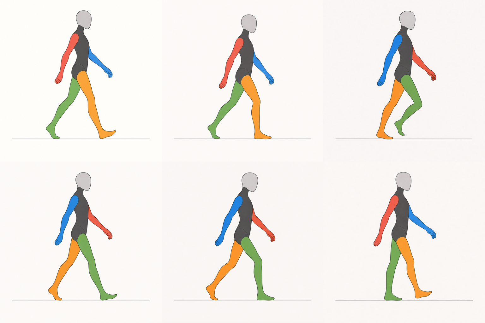
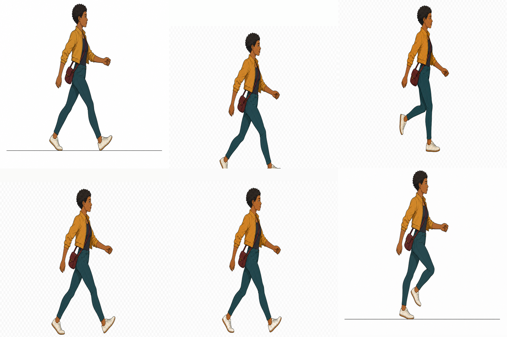

<p align="center">
  <picture>
    <source media="(prefers-color-scheme: dark)" srcset="https://shieldcn.dev/header/document.svg?title=Spritesheet+Expert&subtitle=Production-ready+2D+asset+pipelines.&logo=grid3x3&theme=purple&align=center&mode=dark" />
    
  </picture>
</p>

<p align="center">
  <a href="https://github.com/gvastethecreator/spritesheet-expert-skill/actions/workflows/ci.yml"></a>
  <a href="https://gvastethecreator.github.io/spritesheet-expert-skill/"></a>
  <a href="https://pnpm.io/"></a>
  <a href="https://www.python.org/"></a>
  <a href="LICENSE"></a>
</p>

Codex skill pack for producing and validating sprites, static assets, backgrounds, UI kits, mockups, and coherent multi-family 2D deliveries.

[Project site](https://gvastethecreator.github.io/spritesheet-expert-skill/) · [Install](#quick-install) · [Skills](./SKILLS/README.md) · [Contributing](CONTRIBUTING.md) · [Sponsor](https://github.com/sponsors/gvastethecreator) · [Ko-fi](https://ko-fi.com/gvaste)

The suite turns game-art requests into repeatable, hash-backed pipelines. Use the focused leaf skills for one asset family and `produce-2d-assets` when a delivery spans several families.

- Prepare structured sprite and tileset runs from presets or custom contracts.
- Request provider-native alpha first for isolated sprites, props, and UI. When a provider cannot deliver trustworthy transparency, use neutral gray/black/white or another approved removal-friendly fallback before running the pinned Lucida lane; reviewed BiRefNet/BEN2 compatibility lanes remain available. Keep full-bleed background scene pixels intact.
- Use `$imagegen` by default or the optional dry-run-first `$grok-imagine` image/video route.
- Turn an approved first frame into provider video, then deterministically sample it into the normal verified sprite pipeline.
- Compose atlas PNGs, manifests, deterministic previews, an interactive review workbench, GIFs, checker/black/gray/white alpha boards, and curation exports.
- Run checks for provenance, identity, alignment, animation contracts, and tileset placement.
- Validate static props, layered backgrounds, raster UI states, presentation truth, and aggregate delivery manifests.
- Keep semantic visual generation separate from deterministic extraction, registration, composition, preview, and QA. Fixtures can pass technical smoke gates but never count as representative production media.

## Review evidence

These sheets are real provider and pipeline review outputs. They expose motion, registration, transparency, and curation decisions instead of presenting deterministic fixtures as finished art.

| Character transfer | Motion mechanics |
| --- | --- |
|  |  |
| **Organic motion** | **Alpha review** |
|  |  |

## Quick Install

Install with the Skills CLI:

```powershell
npx skills add gvastethecreator/spritesheet-expert-skill
```

Or download this repo and ask Codex to install `spritesheet-expert` in your workspace.

Skills CLI publishes six packages: `produce-2d-assets`, `spritesheet-expert`, `build-static-game-assets`, `build-game-backgrounds`, `build-game-ui-kits`, and `compose-asset-mockups`.

## Useful Commands

Smoke test the deterministic pipeline:

```powershell
python .\SKILLS\spritesheet-expert\scripts\smoke_pipeline.py
```

Prepare the pinned Python environment and check it:

```powershell
pnpm run setup:test
pnpm run doctor:test
```

The smoke test uses fixtures. Representative game art still requires real generated or imported source images.

Validate the public skill package:

```powershell
pnpm run validate
```

Run the complete contract and integration suite, or the full release gate:

```powershell
pnpm test
pnpm run check
```

## What's Inside

- [`SKILL.md`](./SKILLS/spritesheet-expert/SKILL.md): routing, rules, and pipeline contract.
- [`references/`](./SKILLS/spritesheet-expert/references): atlas, pixel art, animation, isometric, workflow, and QA notes.
- [`scripts/`](./SKILLS/spritesheet-expert/scripts): extraction, curation, composition, preview, and validation helpers.
- [`agents/openai.yaml`](./SKILLS/spritesheet-expert/agents/openai.yaml): optional agent metadata.

Optional runtime extras are isolated by capability: install `SKILLS/spritesheet-expert/scripts/requirements-lucida.txt` for the preferred sprite cutout lane, `requirements-background.txt` for rembg/BiRefNet, and `requirements-video.txt` for video-frame ingestion.
- [`SKILLS/`](./SKILLS/README.md): routing and commands for all six published skills.

## Status

Validated multi-skill pack.

- Local smoke pipeline is available.
- Optional Lucida, rembg, and BEN2 background-removal dependencies are intentionally not bundled.
- Optional video decoding uses the pinned `scripts/requirements-video.txt`; provider inference is never part of tests.
- Generated sample art is not included by default; bring your own licensed source images.
- Rejected motion-reference candidates remain in repository-only `maintenance/` evidence and are never copied into an installed skill.

## Support

If this toolkit helps your production pipeline, you can [sponsor its continued maintenance](https://github.com/sponsors/gvastethecreator) or [support continued development on Ko-fi](https://ko-fi.com/gvaste). Bug reports and focused improvements are welcome through [GitHub Issues](https://github.com/gvastethecreator/spritesheet-expert-skill/issues) and [CONTRIBUTING.md](CONTRIBUTING.md).

## License

MIT. Some bundled sprite pipeline files also preserve their original Apache-2.0 notice files inside the skill package.
