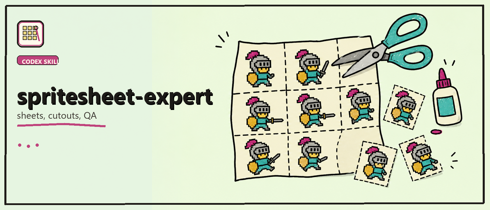

# Spritesheet Expert



> Codex skill pack for building, extracting, curating, and QAing spritesheets, tilesets, and game asset atlases.

[](./LICENSE)
[](#status)

Spritesheet Expert turns a sprite request into a repeatable atlas pipeline: prompts, layout guides, extraction, transparent frames, previews, manifests, and QA checks. It is designed for game assets where consistency, provenance, and frame alignment matter more than a one-off image.

- Prepare structured sprite and tileset runs from presets or custom contracts.
- Extract frames from generated or imported source sheets.
- Compose atlas PNGs, manifests, previews, GIFs, and curation exports.
- Run checks for provenance, identity, alignment, animation contracts, and tileset placement.
- Keep visual generation separate from deterministic pipeline work.

## Quick Install

Download this repo or ask Codex to install `spritesheet-expert` in your workspace.

## Useful Commands

Smoke test the deterministic pipeline:

```powershell
python .\SKILLS\spritesheet-expert\scripts\smoke_pipeline.py
```

The smoke test uses fixtures. Representative game art still requires real generated or imported source images.

## What's Inside

- [`SKILL.md`](./SKILLS/spritesheet-expert/SKILL.md): routing, rules, and pipeline contract.
- [`references/`](./SKILLS/spritesheet-expert/references): atlas, pixel art, animation, isometric, workflow, and QA notes.
- [`scripts/`](./SKILLS/spritesheet-expert/scripts): extraction, curation, composition, preview, and validation helpers.
- [`agents/openai.yaml`](./SKILLS/spritesheet-expert/agents/openai.yaml): optional agent metadata.

## Status

Preview skill pack.

- Local smoke pipeline is available.
- Optional background-removal dependencies are intentionally not bundled.
- Generated sample art is not included by default; bring your own licensed source images.

## License

MIT. Some bundled sprite pipeline files also preserve their original Apache-2.0 notice files inside the skill package.
