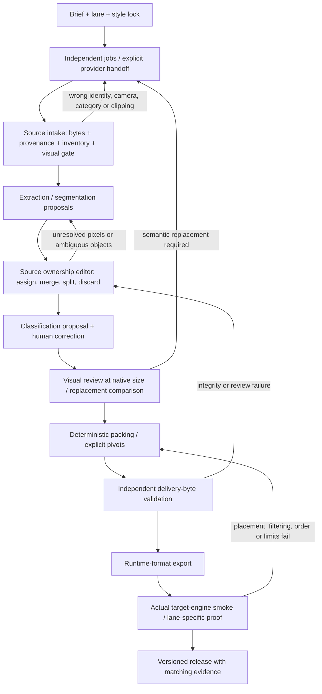

# Production workflow: usable sprites, not merely a sheet image

Revision: 2026-09-05. This reference supplements, rather than replaces, the animation, video, pixel-art, source-intake and provenance contracts linked by `SKILL.md`.

## 1. Choose the actual deliverable

A sprite collection, a fixed-cell sheet, an animation and a tileset are different contracts. Choose the lane before prompting, cutting or packing.

| Lane | Source relationship | Correct evidence | Never infer |
| --- | --- | --- | --- |
| Irregular static item atlas | Independent objects with variable bounds | Exact ownership, crop preservation, inventory, pivots, atlas frames | Animation order, uniform cells, world size from image dimensions |
| True fixed-grid sheet | Explicit equal cells and known margins/gutters | Grid arithmetic, slot coverage, transparent safe margins | A perfect grid from an approximate generated collage |
| Animation rows / video | Ordered poses of one identity over time | Identity anchor, phase semantics, chronology, onion skins, playback, registration | Motion from several similar stills or static classification labels |
| Tileset / repeat texture | Neighbor relationships or a repeat rule | Adjacency, edge/corner behavior, map/repeat proof, projection and pivot metadata | Seamlessness from an isolated attractive tile |

`run_item_atlas_workflow.py`, `validate_item_delivery.py` and `export_item_atlas.py` are the **static irregular-item lane**, not a replacement for the animation compiler. An illustrated asset may need soft alpha; pixel-art assets normally need a reviewed hard-alpha policy. Do not apply a global pixel-art conversion to all lanes.

## 2. Freeze a production brief

Record project, asset kind, consumer engine/version, native display size, texture limit, inventory, grouping, identifiers, allowed transformations, transparency policy, licensing/provenance and review owner. State what is unknown; do not invent camera degrees, world footprints or collision boxes.

The brief must contain a reusable **style lock**: camera/projection and orientation; apparent scale; silhouette/outline treatment; palette and material rendering; lighting; detail budget; background/alpha; accepted reference images with paths and hashes; explicit rejection examples. A phrase such as “match the previous sheet” is insufficient for a portable handoff.

A project profile is data, not a global policy. Black Flag restrictions must not leak into unrelated UI kits, monsters, isometric scenes, illustration or animation. For a Black Flag cohort, freeze the current approved shallow map-compatible inclination and compare every piece to the same accepted reference. Do not mix flat objects with strong three-quarter pallets simply because each isolated object looks good. Floor, wall and vertical assets may need separately declared cohorts; never change their camera implicitly inside a batch.

The brief and batch ledger described here are agent-authored production documents. This revision does **not** claim a new universal brief parser or automatic batch-ledger service is implemented.

## 3. Plan before generation; count the right thing

For a request for ten separate category sheets, create ten independently identified jobs. One requested sheet means one image result; a multicategory collage is not ten results. A sheet may contain the intended variations of its one category. A compact animation grid may contain the required poses of one identity. Internal contact sheets remain valid QA artifacts and must never be substituted for the requested separate delivery files.

For each job record: stable job ID, sequence, category/identity, lane, expanded positive prompt, explicit exclusions, references, expected artifacts, source provenance, output count, current attempt and acceptance status. Separate requested, generated, rejected, accepted and delivered counts. A corrupt, duplicated, semantically contaminated or wrongly projected result does not increment accepted count. Additional results are governed by the user's explicit quota, not a hardcoded global “exactly ten” rule.

Use one immutable accepted reference set across a cohort. On replacement, regenerate only the selected identity/category with its own job. Do not reuse a failed multicategory collage as the identity anchor. Do not crop a collage merely to claim that independent generation occurred.

Provider execution remains explicit and outside deterministic processing. Do not consume paid inference in tests. Do not turn fixtures, layout guides, model masks or PIL/SVG debugging drawings into representative production art.

### Prompt assembly order

1. Identity/category and one-image deliverable.
2. Exact accepted reference roles, camera and scale lock.
3. Positive silhouette, materials, palette, lighting and detail requirements.
4. Intended layout, slot/object count and safe margins for this lane.
5. Transparency and prohibited contamination.
6. Acceptance checks and the target consumer.

Expand those fields in the actual provider handoff; do not pass unresolved placeholders. Keep exact bytes of the submitted prompt and returned source. Reject internally contradictory constraints before execution. A scalar model confidence is not an approval threshold for camera, category purity or artistic quality.

## 4. Pipeline and repair loops



| Stage | Input | Output / checkpoint | Failure action |
| --- | --- | --- | --- |
| Intake | Provider/import source and job | Original byte snapshot, provenance, accepted-source decision | Reject before segmentation for wrong semantics/camera; obtain valid alpha without repainting identity |
| Extract | Accepted source | Native crops, source bounds, mask proposals | Inspect touching groups and detached components; preserve unresolved pixels |
| Ownership | Proposals + exact source | New reviewed manifest, pending/discard masks, lineage | Assign/merge/split; never silently erase unassigned pixels |
| Classify | Verified crops on light/dark backgrounds | Taxonomy-bound proposal | Allow unknown/abstention; correct explicitly; do not invent certainty |
| Review | Current crop, source, peers, native preview | Explicit per-item decisions | Reject, replace or regenerate selected items; compare against immutable references |
| Pack | Accepted native crops and declared pivots | Atlas, frames, reserved cells, ownership evidence | No implicit rotation/rescale; respect target texture budgets |
| Verify | Active manifest and disk artifacts | `item-delivery-check-v1` receipt | Block corruption even in drafts; require all-item approval for final static delivery |
| Export | Verified snapshot | Runtime JSON Hash or complete audit ZIP | New destination; preserve prior delivery; record draft status |
| Engine proof | Export + target configuration | Actual loader/placement/filtering evidence | Never label a Canvas inspection as engine proof |

Edits invalidate evidence whose inputs changed. Pixel changes invalidate crop review; a changed camera/style brief invalidates visual acceptance; geometry changes invalidate placement proof; classification changes invalidate semantic review; repacking invalidates atlas hashes and engine proof. Rebuild the affected downstream proof, not an unrelated provider output.

## 5. Mid-pipeline interfaces and their boundaries

**Workflow Launcher:** prepare prompts/commands/handoffs. Preparation is not provider execution. Validate fields and inspect command arguments before copying; the legacy launcher does not yet provide a fully typed argv execution boundary.

**Local Process / Ownership editor:** import a transparent source, run available local analysis, inspect source masks, assign pending pixels, merge pieces, discard explicit noise, correct tags and approve selected items. Saved reviews create successor artifacts. Disable the “doubts” filter and review **all** pending items, not only flagged ones. A stopped process is not completed processing.

**Portable Atlas Lab:** review/replacement handoffs exist, but this audit identified legacy basename resolution and asynchronous replacement-target risks. Until the linked hardening work lands, do not use a displayed legacy thumbnail as the sole basis of production approval. Cross-check exact files in Delivery Lab and the authoritative validator. Do not switch selected items while a replacement is hashing.

**Delivery Lab (`studio/delivery-lab.html`):** four read-only views: atlas frames/cells, source bounds, native pivot placement, delivery evidence. It verifies original file identities before drawing; missing or stale files block the preview. It accepts an optional Python receipt and verifies that its manifest and recorded artifacts still match. Its exported browser inspection is not an approval document or a signed attestation. Placement is a Canvas diagnostic, not Phaser/Godot execution.

**Animation selector / Preview Workbench:** use the existing video selector, chronological strip, pause/step/scrub, onion skins and lane-specific QA for temporal work. Do not pass static atlas packing order into an animation timeline.

A future unified session should connect these surfaces with one active manifest head and durable drafts. Independent screens must not become independent mutable sources of truth.

## 6. Practical static-item workflow

Commands below run from the installed `spritesheet-expert` skill directory. At repository root, prefix scripts with `SKILLS/spritesheet-expert/`, or use `pnpm studio` for the bundled app.

```powershell
# Start without model downloads or inference.
python scripts/run_item_atlas_workflow.py source.png --output-dir runs/example --models none

# Local UI; model profiles are available only after documented runtime setup.
python scripts/serve_item_studio.py --workspace .local/studio-workspace
```

Read `references/local-model-item-workflow.md` before using `standard` or `light`: install the isolated runtime, prepare pinned checkpoints, then run the offline worker. Models analyze existing art; they do not change its provenance or certify usable output. No GPU measurements are implied by this documentation.

Use the **active manifest path** in `workflow.json`, including a classified or reviewed successor, not an assumed `alpha/manifest.json`. The server now protects completed processing from a start action that would reset its review head. Direct CLI replay of an already reviewed run remains a known risk: use a fresh output directory for changed processing inputs and preserve reviewed runs.

```powershell
# Replace this example with the actual active manifest.
python scripts/validate_item_delivery.py --manifest runs/example/reviews/current/manifest.json

# Explicit draft: allows pending review, NEVER stale/corrupt artifacts.
python scripts/validate_item_delivery.py --manifest runs/example/reviews/current/manifest.json --draft

# New destination outside the source run; no force overwrite.
python scripts/export_item_atlas.py --manifest runs/example/reviews/current/manifest.json --output-dir deliveries/example-v1
```

Validator exit codes: `0` pass; `2` review required; `3` invalid artifacts. Its default maximum texture size is **not** a hardware capability probe; set `--max-texture-size` for the intended target.

A final static check requires all emitted items approved, no pending source pixels, no source-edge hard failures, valid exact geometry/hashes/ownership, and non-fixture source provenance. Classification completeness is a separate project requirement: the validator does not claim every unknown label is a geometry failure.

Runtime export contains `atlas.png`, `atlas.json`, `delivery-check.json`, `delivery.json`, an audit snapshot and README. Frame coordinates use actual visible crops, not reserved packing cells. The JSON Hash adapter is for static items and preserves stable item IDs. `source-manifest.snapshot.json` is audit evidence, **not** a standalone relocatable source run. The Studio ZIP serves that fuller audit/review use case.

## 7. Quality rubric: review the result at its intended scale

A technical pass is necessary, never sufficient. Check the following independently rather than averaging failures into a reassuring total score.

| Dimension | Inspect | Hard rejection examples |
| --- | --- | --- |
| Inventory / semantics | Exact requested category, unique silhouette, complete object | Wrong category, duplicate substituted for missing job, accidental extra character |
| Camera / scale | Side-by-side accepted references; target-size placement | Mixed top-down and strong 3/4 inside one locked cohort; size drift |
| Alpha / boundaries | Native pixels over checker, black, gray and white | Fake transparency, matte fringe, clipped silhouettes, cross-item pixels |
| Shape / detail | Silhouette at 1×, material hierarchy, pixel clusters where applicable | Micro-noise replacing readable shapes, destroyed thin appendages |
| Animation | Exact identity, anatomy, ordered action phases, contacts and loop seam | Camera motion, identity morph, duplicate poses used as motion, incorrect chronology |
| Tiles / projection | Map preview, adjacency, repetition, declared footprint and sorting | Seam failure, wrong corners, isolated tile looks right but repeated map fails |
| Runtime | Actual engine loader, frame IDs, origins, filtering, device limits | Wrong crop vs cell, unstable baseline, bleeding, missing frames, oversized texture |

Never “fix” a camera mistake by squeezing the atlas, hide a missing body part with a tighter crop, or repaint a semantic failure procedurally. Pixel-preserving extraction is permitted processing; generating replacement semantic content is a provider task. Keep original and candidate artifacts for comparison and approval.

## 8. Evaluation and release evidence

Use two datasets: synthetic adversarial fixtures for geometry/security/failure paths, and a versioned representative corpus of real project art with reviewed masks and decisions. Separate calibration cases from held-out evaluation. Include detached handles, tiny parts, touching objects, weak alpha bridges, holes, semitransparent effects, near-duplicates, camera mismatches and empty/opaque/corrupted files.

Report object precision/recall, ownership coverage and conflicts, missing-pixel rate, exact RGB/alpha preservation, classification confusion/unknown rate, manual correction time, accepted yield per generation attempt, and native-size visual acceptance. Report cold/warm latency and peak VRAM on named hardware only after measurement. Compare alpha-only, model-assisted and human-corrected results. Model-generated confidence values are not calibrated probabilities.

Release evidence must identify the active manifest, source hashes, model/checkpoint/config versions when used, review decisions, known waivers, runtime export hashes and actual engine-proof configuration. Human approval and unsigned JSON receipts are not cryptographic author authentication. A release may be technically verified but still awaiting art direction, semantic review or engine acceptance; say so explicitly.

## Primary implementation references

- Qwen3-VL model card: https://huggingface.co/Qwen/Qwen3-VL-4B-Instruct
- SAM2.1 model card: https://huggingface.co/facebook/sam2.1-hiera-small
- Transformers SAM2 processing: https://huggingface.co/docs/transformers/model_doc/sam2
- Phaser JSON Hash texture parser: https://docs.phaser.io/api-documentation/namespace/textures-parsers
- Godot AtlasTexture region/margin contract: https://docs.godotengine.org/en/stable/classes/class_atlastexture.html

These sources explain model/format interfaces; they do not establish this project's artistic yield or engine compatibility without its own measurements.
