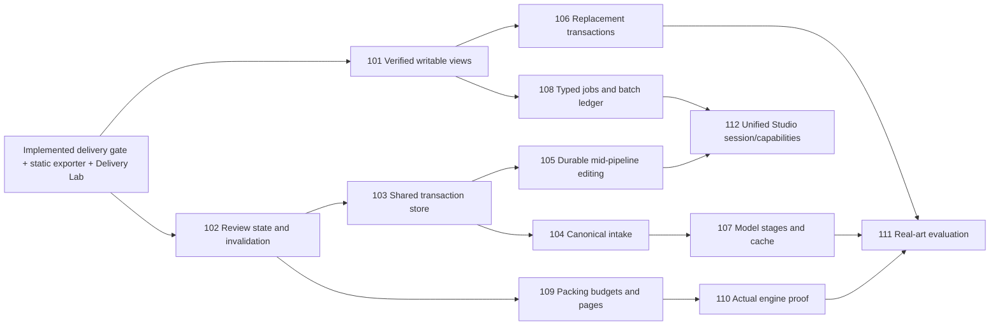

# Studio production backlog and execution order

Revision: 2026-09-05. Companion: [deep audit](../reviews/2026-09-05-studio-production-audit.md). These are implementation tickets, not a claim that the listed features already exist. Paths below are relative to `SKILLS/spritesheet-expert` unless noted.

## Delivery slices and dependencies

First deliver a trustworthy imported-static-sheet vertical slice, then resilient replacement/generation intake, then measured model automation and additional engine/lane surfaces. Do not build an extensive desktop shell before the acceptance paths below work. Optional models and paid providers must remain outside the default deterministic gate.

## Already implemented by this audit

**DELIVERY-001 — independent current-byte validation.** `spritecore/item_delivery.py` and `validate_item_delivery.py`: exact artifact paths/hashes, real source/crop/atlas pixels, geometry/ownership accounting, all-item final review, fixtures/drafts/hard-edge handling, diagnostic exit codes. Covered by deterministic adversarial tests; not an aesthetic evaluator.

**DELIVERY-002 — immutable static runtime export.** `export_item_atlas.py`: native-frame JSON Hash, stable IDs/pivots, new destination, matching receipt, no deletion of prior delivery, explicit no-engine/no-animation claims. Repeat exports are tested byte-for-byte.

**DELIVERY-003 — server boundary.** `serve_item_studio.py`: all-pending review count, authoritative final/draft gate, protected completed start, exact verified bytes in archive, symlink rejection and bounded archive inputs. A server mutex is not the cross-process transaction store below.

**DELIVERY-004 — read-only verified inspection.** `studio/delivery-lab.html` and `.js`: atlas/source/placement/evidence surfaces, exact file identity, stale receipt rejection, native zoom/backgrounds. Does not silently repair the legacy writable viewer.

**QUALITY-001 — production contract.** Core skill now requires lane selection, explicit style/camera/scale references, correct independent batch outputs, rejection/repair loops and truthful completion. `references/production-workflow.md` provides operator commands, interface boundaries and evaluation design.

## STUDIO-101 — Bind every writable view to verified artifact identities

**Priority/status:** P0 / OPEN. **Owner surface:** `studio/app.js`, shared browser artifact resolver, portable review import. **Depends on:** DELIVERY-001/004. **Audit:** F03/F04.

**Problem/reproduction:** Load manifest A and a folder containing same-named crops from B. Basename/suffix fallback may show B while a review binds to A. Then start hashing replacement X and change selected item before the await completes.

**Implement:** Extract the exact-path/hash resolver into a shared module; index one explicit manifest-root namespace; reject aliases/collisions/traversal; verify images before enabling approval. Capture item ID, run ID, manifest hash and session revision in every asynchronous edit and reject stale completions. Clear or explicitly migrate state on manifest/folder change. Avoid a second browser-only approval truth.

**Acceptance:** Two same-named crops in different runs cannot cross-resolve; stale/corrupt/missing source/crop disables approval; load races cannot mix manifests; replacement stays on its captured target or aborts; changing folders cannot retain old object URLs/reviews. Browser tests use adversarial duplicate basenames, delayed hashing and rapid selection changes. No unverified image may be used for a writable review decision.

**Definition of done:** Legacy Atlas Lab and local writable surfaces share the verified resolver; writable decisions contain current artifact identity; migration behavior is documented. A warning-only change is insufficient.

## STUDIO-102 — One active review head, scoped approvals and safe resume

**Priority/status:** P0 / OPEN (server completed-start mitigation shipped). **Owner surface:** `run_item_atlas_workflow.py`, `item_ownership.py`, manifest completion schema, review import. **Depends on:** DELIVERY-001. **Audit:** F01/F05/F06.

**Implement:** Separate processing output, active reviewed head and released snapshot. Preserve descendant review head on idempotent CLI resume. Changed processing inputs create a new explicit revision, not a silent reset. Bind visual, semantic and geometry decisions to the exact hashes they cover. Invalidate content review on any ownership/pixel change, semantic review on taxonomy/tag changes, placement proof on pivot/frame changes. Derive review completeness from all emitted items; do not trust legacy `reviewGatePassed` alone.

**Acceptance:** Process → approve → restart server → CLI resume retains identical active reviewed manifest. Painting, merge/split, overlap resolution and content replacement cannot inherit an obsolete approval. Tags cannot keep a stale semantic decision. Repacking preserves unchanged content review but invalidates atlas-dependent proof. Undo creates an explicit revision rather than reviving unrelated approval metadata. Hard clipping remains blocked despite an approved label. Existing manifest versions have explicit migration tests.

**Definition of done:** Browser, CLI, reviewer and exporter report the same scoped state. A completed process does not imply reviewed, and reviewed does not imply engine-tested.

## STUDIO-103 — Transactional run store and cross-process coordination

**Priority/status:** P0 / OPEN. **Owner surface:** compiler writers, workflow state, review application, export. **Depends on:** STUDIO-102. **Audit:** F02/F07.

**Implement:** One run-level mutation protocol across CLI and server: lock ownership, timeout/recovery semantics, immutable revision directories, staged validation, compare-and-swap active head. Preserve old valid output until a verified successor is committed. Never `rmtree` the only valid output before a potentially failing rename. Read/hash/decode from a stable snapshot where practical. Use deterministic ordered QA flags rather than unordered set serialization.

**Acceptance:** Inject exceptions before write, after write, before rename and after rename; terminate a process at each boundary; corrupt an incomplete staging directory; race two review writers and an exporter. Exactly one successor may become active, previous valid delivery remains usable, stale operations fail clearly, and restart identifies recoverable staging without accepting it as complete. Run on Windows and Linux; no reliance on Unix-only rename/lock behavior.

**Definition of done:** No simulated crash loses the last valid revision or publishes mixed hashes. Document that local hashes are not authenticated user signatures.

## STUDIO-104 — Shared source-intake and decoder policy

**Priority/status:** P1 / OPEN. **Owner surface:** HTTP import, CLI builder, provider-return intake. **Depends on:** STUDIO-103. **Audit:** F09.

**Implement:** One preflight service for actual format, dimensions, animated container policy, visible alpha, transparent exterior, palette alpha and safe conversion. Preserve original bytes/provenance even when creating a normalized RGBA derivative. Limit compressed bytes, decoded pixels, frame count and aggregate allocation before expensive work. Return stable error codes, not only exception strings. Validate provider job/source/expected identity before a returned file enters a run.

**Acceptance:** Opaque RGB, completely transparent RGBA, palette PNG with transparency, partially transparent edge, mismatched extension/MIME, animated WebP/APNG, truncated decode, decompression-bomb dimensions and oversized request have identical CLI/API outcomes. An intended illustration glow is not hard-thresholded by a global pixel-art rule. Wrong-category or wrong-camera source is rejected at the visual intake gate, not “repaired” into acceptance by segmentation.

**Definition of done:** Intake report states original and normalized hashes, decoder policy, acceptance/rejection and next action. Tests never call a production provider.

## STUDIO-105 — Durable editing sessions and continuous mask tools

**Priority/status:** P1 / OPEN. **Owner surface:** `studio/local-workflow.js`, ownership operation schema, session store. **Depends on:** STUDIO-101/102/103. **Audit:** F10.

**Implement:** Durable draft edits bound to a manifest revision, explicit apply/discard, undo/redo with bounded history, dirty-state guard before run/selection change or polling refresh, all-pending filter separate from QA-flag filter. Interpolate brush strokes in source coordinates, preserve source pixels, support mask visibility/pending overlays and keyboard navigation. Normalize/deduplicate operation IDs; return informative conflicts for stale operations. Validate taxonomy edits through the same taxonomy as classification.

**Acceptance:** A poll cannot silently remove unsaved strokes. Reload restores a compatible draft; incompatible drafts are visibly quarantined. Fast mouse movement produces continuous coverage independent of event frequency/zoom. Duplicate merge IDs produce a validated error, not a partial operation. Users can inspect all unapproved items even when no flags exist. Undo/redo/reload does not create duplicate ownership or false approvals.

**Definition of done:** Source, crop, mask, pending/discard and current decision remain visible at native scale. At least one full manual correction session is tested in a real browser.

## STUDIO-106 — Replacement as a transaction, not a filename promise

**Priority/status:** P0 correctness / P1 full UX; OPEN. **Owner surface:** replacement UI, item-review importer, returned-provider intake. **Depends on:** STUDIO-101/102/103/104. **Audit:** F04/F06.

**Implement:** Package candidate bytes with unique paths/hashes and lineage. Compare original/candidate side-by-side and overlay at the same native scale, explicit anchors and approved reference camera. Record disposition of the old item's owned pixels; do not falsify source conservation by pretending a generated replacement came from the original sheet. Either a versioned multi-source manifest or an explicit new accepted source composition must represent replacement lineage. Add apply/reject/regenerate states and rollback.

**Acceptance:** Same filenames cannot collide; changing selection during hash/decode cannot change target; corrupt candidate blocks; missing bytes cannot be called an applied replacement; stale parent review fails atomically. Pixel replacement invalidates review, classification and downstream atlas/engine evidence as appropriate. Rejection preserves old accepted art. A generated replacement identifies its new source/provider while imported candidates stay imported.

**Definition of done:** One real imported candidate and one explicit returned-generation candidate can be inspected, accepted into a new revision, repacked and delivered with correct provenance. No paid test execution is required; returned-provider fixtures test the protocol only.

## STUDIO-107 — Stage-specific model caching, uncertainty and runtime evidence

**Priority/status:** P1 / OPEN. **Owner surface:** `run_item_model_worker.py`, model runtime/checkpoint metadata. **Depends on:** STUDIO-104. **Audit:** F08/F12.

**Implement:** Independently key semantic proposals, SAM refinement and classification using exact input hashes, model ID + resolved revision, processor/config version, prompt/schema and relevant parameters. Do not reuse stale mask revision metadata from a Qwen cache entry. Explicitly describe cache hit vs model work, cancellation boundaries and restart behavior. Keep unknown/abstention valid. Reset memory measurement windows and release previous-stage GPU allocations before loading the next model.

**Acceptance:** Changing mask model/revision invalidates mask results, not unrelated Qwen work; changing prompt/taxonomy invalidates the appropriate semantic results; corrupt cache fails before reuse; offline missing weights report a setup error without silently downloading. Cancellation retains valid completed job artifacts and never marks a partial run done. Warm/cold results and measured VRAM include named environment, sample count and confidence limitations.

**Definition of done:** Benchmarks are actual measurements on the intended hardware, not estimates inferred from model parameter count. Provider generation remains outside model analysis and default tests.

## STUDIO-108 — Typed handoffs and an accepted-output batch ledger

**Priority/status:** P0 execution-boundary correctness / P1 complete batch UX; OPEN. **Owner surface:** workflow registry, launcher, handoff schema, intake ledger. **Depends on:** STUDIO-101/104. **Audit:** F11 and production brief gaps.

**Implement:** Validate form fields before copy/queue; use structured argv and named input artifacts rather than interpolated shell text as authority. Keep a prepared job ID stable across prompt/JSON/command tabs and copying. Store requested, generated, rejected, accepted and delivered counts separately. Expand a versioned project style lock and exact reference hashes into every generation job. Record retries and duplicate identity decisions. Render shell-specific presentation only from validated arguments.

**Acceptance:** Quotes, Unicode paths, newlines and shell metacharacters cannot alter the intended command arguments. Invalid numbers/required fields cannot queue. Ten requested separate sheets create ten distinct jobs/artifacts; one ten-category collage counts as zero accepted independent sheets. A duplicate cannot fill a missing category. An explicit at-least-ten policy accepts approved extras without changing an exact-ten policy elsewhere. Valid compact animation grids remain possible. Paid execution requires explicit authorization and no implicit retry after a successful quota-sealed media call.

**Definition of done:** A dry-run ledger can reproduce the exact submitted jobs and identify why each result was accepted or rejected without chat history.

## STUDIO-109 — Bounded, stable packing and page-aware delivery

**Priority/status:** P1 / OPEN. **Owner surface:** item packer, atlas manifest, exporter. **Depends on:** STUDIO-102/103/104. **Audit:** F09/F13.

**Implement:** Validate target max width/height/pages/pixels before allocation. Preserve native scale and declared pivots. Define deterministic page assignment and stable ordering, with a page ID in every frame reference; keep sprite identity independent from cell/page placement. Make padding/extrusion policy explicit and keep ownership semantics separate from deliberate runtime edge extrusion. Reject impossible constraints instead of silently resizing.

**Acceptance:** Very tall, very wide, numerous tiny, single oversize and mixed-size fixtures have bounded allocation. Same input/config yields identical pages/metadata. A smaller device limit either creates a valid explicit multi-page export or fails clearly. Every exported frame points to the correct page and crop. No tiny item acquires a large world footprint because it reserves a larger packing cell.

**Definition of done:** The strict validator and engine adapter both understand pages; no metadata-only page feature.

## STUDIO-110 — Actual engine smoke and lane-specific runtime inspectors

**Priority/status:** P1 / OPEN. **Owner surface:** Phaser test harness first; Godot adapter only when required. **Depends on:** STUDIO-109, existing animation/tileset proof lanes. **Audit:** F13.

**Implement:** Load the exported JSON Hash in a pinned target Phaser version using its real loader; verify every stable key, dimensions and origin on a test scene. Cover nearest/linear filtering and non-integer camera movement where relevant. For Godot, map atlas region/margin/origin explicitly and test an actual scene. Keep animation durations/order/events distinct from static item order; use existing animation workbench and tile map proofs rather than fake temporal previews.

**Acceptance:** Native-size rendered frames agree with expected crop/anchor placement; no neighbor bleed under declared filtering; missing IDs/wrong page/frame fail. Engine artifact records version, device/renderer settings and input hashes. Changing atlas/pivot invalidates smoke evidence. Canvas Delivery Lab remains labeled a diagnostic, never counted as this engine run.

**Definition of done:** One complete target-engine loading/placement regression runs automatically. A generic format citation or JSON schema pass is not enough.

## STUDIO-111 — Representative visual evaluation and repair-cost benchmarks

**Priority/status:** P1 / OPEN. **Owner surface:** versioned fixtures/corpus metadata, evaluation scripts, human review rubric. **Depends on:** STUDIO-106/107/110. **Audit:** F14.

**Implement:** Assemble approved, license/provenance-safe real sheets for intended project styles plus held-out failures. Include detached parts, touching objects, weak-alpha bridges, holes, glow, near-duplicates, clipped silhouettes, wrong-camera cohorts, over-detailed unreadable props and wrong-category outputs. Label object ownership, category, human acceptance and expected repair. Compare alpha-only, model-assisted and human-corrected workflows on the same immutable source set.

**Acceptance:** Report object precision/recall, ownership missing/conflict rates, exact pixel preservation, class confusion/unknown rate, visual accepted yield per generation attempt and correction time. Report failures and uncertainty, not only average score. Do not average a hard camera/category/identity failure into a passing total. Synthetic fixtures remain tagged as tests and cannot masquerade as generated artwork in a showcase.

**Definition of done:** New prompt/model/extraction settings are adopted only with reproducible quality/yield or correction-cost evidence; no claim of improved artistic output from unit tests alone.

## STUDIO-112 — Unified agent-first Studio without a second pipeline

**Priority/status:** P2 / OPEN. **Owner surface:** workflow navigation, session index, capability API. **Depends on:** STUDIO-105/108 and stable artifact contracts.

**Implement:** One session entry connects brief, job queue, source intake, ownership review, classification, candidate comparison, atlas/placement, animation/tile proof and delivery. Expose capabilities and typed operations through a narrow local agent interface; optional MCP integration delegates to the same implementation rather than adding duplicate extraction logic. All mutations return new revision identity and artifacts. Read-only share/review modes must not expose local mutation tokens.

**Acceptance:** A user can enter at source import, an existing manifest or a returned replacement without recreating the whole pipeline. An agent can inspect blockers and request one explicit operation using the same contracts as the UI. No absent model/provider/engine capability appears “ready.” No hidden paid execution, remote runtime dependency or browser-only state is required for resuming saved work.

**Definition of done:** Portable installation and relocation tests pass; keyboard navigation, error recovery, cancellation and run discovery work on the supported Windows/Linux environments. Packaging polish follows proven workflows, not vice versa.

## Completion reporting template

Each implementation PR must state: baseline and changed contracts; exact files; migrated/compatible formats; regression cases; deterministic tests executed; browser tests executed; model tests executed or explicitly not run; actual engine proof or explicitly absent; residual blockers and affected project profiles. Never collapse these into one undocumented green “ready” badge.
